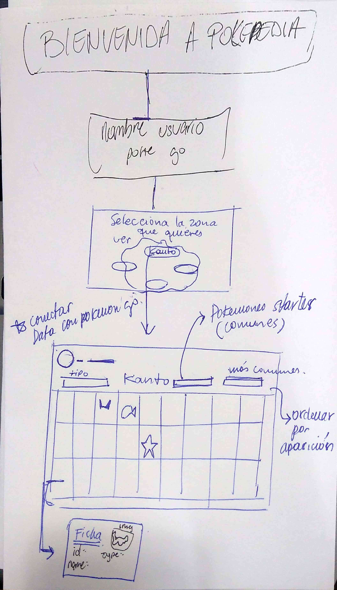
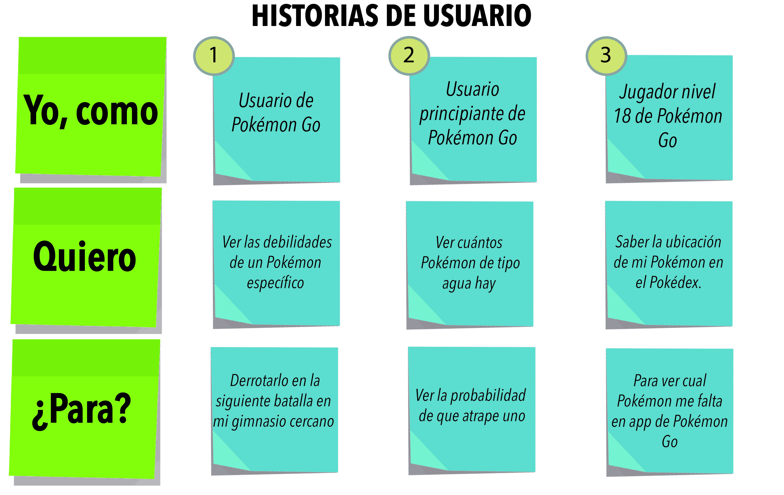

# Poképedia

## 👀 ¿De qué se trata? 
**Poképedia** es una aplicación web responsiva que esta diseñada para jugadores de nivel medio de [Pokémon Go!](https://www.pokemongo.com/es-es/) . Esta te permite acceder a información detallada sobre tus Pokémones favoritos y buscar intuitivamente características y estadísticas que quieras conocer. 

* [¿Cómo funciona?](#como-funciona)
* [Objetivos de la aplicación](#objetivos-de-la-aplicacion)
* [Planificación del proyecto](#planificacion-del-proyecto)
* [Estudio de usuario](#estudio-de-usuario)
* [Diseño y testeos a usuarios](#diseño-y-testeo-a-usuarios)
* [Implementación al código](#implementación-al-codigo)
* [Resumen](#resumen)
* [Reflexión y futuras iteraciones](#reflexion-y-futuras-iteraciones)

***

## 💡 ¿Cómo funciona? 
Poképedia es una aplicación web que te permite enlazar tu cuenta de Pokémon Go a la plataforma y asi crear un *perfil de usuario*, en este puedes guardar y ver estadísticas de tus progresos en el juego y también de tus pokémones favoritos revisados dentro de la misma app. 
***
## 📋 Objetivos de la aplicación 
* Entrar a la plataforma utilizando y enlazando tu cuenta de Pokémon Go. 
* Dividir los Pokémones según el sector donde ellos se hayan encontrado y permitir al usuario escojerlos de esta forma. 
* Visualizar Pokémones a través de tarjetas con información destacada.

* Clasificar y filtrar Pokémones según los deseos del usuario para acceder mas facilmente a alguna característica específica. 

* Proporcionar un perfil de usuario que permita guardar progresos y estadísticas de lo que el usuario desee. 

***
## ✏️ Planificación del proyecto
 
 Después de leer detenidamente los [requisitos del proyecto](https://github.com/Laboratoria/SCL008-data-lovers), se procedió a realizar una *lista de tareas* según los procedimientos mas comunes para llevar a cabo esta misión. Posteriormente se iría puliendo y desglosando de acuerdo a las *historias de usuario* , *prototipos de baja y alta fidelidad* y *encuestas* que en conjunto nos dieron una idea más específica sobre lo que debíamos hacer y como comenzar a trabajar.  
 También se realizó un breve *diagráma de flujo* donde se expusieron las principales características que querían mostrarse en la aplicación. A pesar de que era un bosquejo bastante arcaico, nos dio la idea que queríamos realizar después en el el *prototipo de baja fidelidad*

 

 link de enlace para tablero de planificación (Trello) [aquí](https://trello.com/b/YGdTtMSS/proyecto-2-data-lovers) 👈

***
## 👦👧 Estudio de usuario

### Historias de usuario
Para poder crearse una idea mucho más clara de los objetivos que se necesitaban cumplir en la aplicación, se decidió crear algunas *Historias de usuario*, donde les dabamos a estos usuarios ideales algunas necesidades a cumplir para tener una mejor idea de como realizarlas. 

Aquí se muestra el primer acercamiento de las historias de usuario a realizar.

Aquí hay una primera iteración de estas.

Ultima iteración de historias de usuario, como se puede observar, se ha cambiado el formato y se han desglosado mas especificamente las acciones y necesidades. 

### Encuestas
***
## Diseño y testeos a usuarios

### Diseño de la Interfaz de Usuario
#### Prototipo de baja fidelidad
#### Prototipo de alta fidelidad

lalala
***

## Implementación al código (Resultados)
### [link a deploy del proyecto](lalal)
### Pruebas unitarias 
#### Mostrar data
#### Filtrar data
#### Ordenar 
#### Estadísticas 
***

## Resumen
### Reflexión y futuras iteraciones

